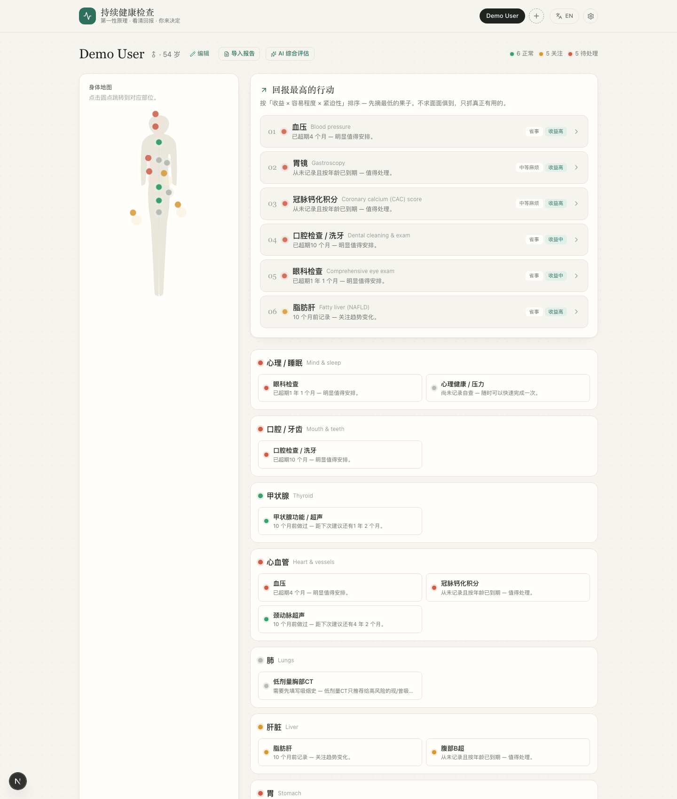

# Ongoing Health Check

> A **private, local-first** personal health dashboard that explains the **science and the ROI** behind every check — so you act on the few things that matter, not "do every test."

Your screenings and lab results, mapped onto a body diagram with calm traffic-lights (🟢🟡🔴). For each one it surfaces the **first-principles reasoning**, the **return on investment**, and **risk in perspective** (e.g. how the anesthesia risk of a sedated endoscopy actually compares to everyday alcohol). An optional AI layer reads your *whole* picture and gives a second opinion — but it **proposes, you confirm**; it never silently overrides anything.

Everything runs on your machine. No account, no cloud, no data leaves your computer.

🌐 **Bilingual** (中文 / English) · 🔒 **Local-first & private** · 🔑 **Bring-your-own AI key** · 🖥️ **One-click desktop app**

> ⚠️ **Educational decision-support only — not medical advice.** See [DISCLAIMER.md](DISCLAIMER.md).

---

## Screenshots



*Body map + highest-ROI moves, ranked by payoff × ease × urgency.*

### Fully bilingual — 中文 / English

One toggle switches the entire app — not just the UI, but all the knowledge content too. Same dashboard, in 中文:


*Screenshots use the fictional demo data — run `npm run setup && npm run dev` to try it (toggle 中文 / English top-right, or use `?lang=en` / `?lang=zh`).*

<!-- Optional: add docs/item-detail.png (click an item, e.g. Gastroscopy) to show the
     first-principles / ROI / risk depth. See docs/README.md for how. -->

## Why this exists

**The earlier you catch something, the more it changes the outcome — sometimes everything.**

This project is personal. My mother was diagnosed with breast cancer — and because it was caught early, the story has a very different ending than it could have had. Around the same time, a close friend's father had a heart attack that earlier warning signs might have surfaced. Watching both, the same thought kept coming back: **so much of how health turns out is decided long before any symptoms — by whether the right check happened at the right time.**

Yet most people don't have a clear, trusted picture of *which* checks actually matter for them, *why*, and *what they're worth*. The information is scattered, alarmist, or buried in jargon — so people either ignore screening or anxiously "do everything." Neither is right.

So this is built on a different premise: **a curious person who trusts data should be able to see why a check matters, what it actually buys them, and what it costs — then make their own call.** The traffic lights tell you *how much to care*; the knowledge layer tells you *why*. The goal isn't more tests — it's the *right* ones, early, with eyes open.

> Caveat, stated plainly: this is an educational tool, not a doctor, and not a substitute for screening guidelines or medical care. See [DISCLAIMER.md](DISCLAIMER.md).

## What it does

- **Body map** — tap a region to see its checks, colored by status.
- **Highest-ROI moves** — your low-hanging fruit, ranked by payoff × ease × urgency.
- **First principles + ROI + risk** for every item — the science, the trade-off, and honest risk comparisons.
- **Import any report** — paste text, or upload a photo / screenshot / **PDF** (a full checkup report or a single result). AI extracts the values; you confirm before anything is saved. Re-uploading the same report is safe (deduped).
- **Captures everything** — not just tracked screenings, but every lab value (flagged from the report's *own* reference range), plus **conditions** and **procedures/surgeries** from operative notes.
- **AI comprehensive review** — an optional second opinion over your whole snapshot that connects the dots a rules engine can't (e.g. "a 2024 achalasia operation implies you were scoped then") and **proposes confirmable updates** — it never overrides the deterministic status.
- **Per-item AI threads** — ask follow-ups that remember the conversation; saved and restored locally.
- **Smart screening logic** — a recent colonoscopy marks FIT/DRE "covered"; benign findings (simple cysts, superficial gastritis) stay green instead of crying wolf.
- **Trend sparklines** for repeated lab values over time.

## Privacy

- **Local-first SQLite** — your health data lives in a file on your machine and never leaves it.
- **Bring-your-own AI key** — entered in-app; used only for *your* requests, directly to your chosen provider.
- The curated knowledge base + manual logging work **fully offline, no key required**.

## Quick start

```bash
npm install
npm run setup      # generate Prisma client, create the SQLite DB, seed demo data
npm run dev        # → http://localhost:3000
```

You'll land on a fully populated **demo** dashboard (fictional "Demo User" data) so you can see how everything works. Clear it and add your own anytime.

Optional — enable the AI features by adding your own keys to `.env` (see `.env.example`):

```
ANTHROPIC_API_KEY="sk-ant-..."   # default model: claude-sonnet-4-6
OPENAI_API_KEY="sk-..."          # alternative: gpt-5.5
```

In the desktop app, keys are entered in ⚙️ **Settings** instead.

## Desktop app (one-click, fully local)

For sending to friends & family — each person runs their own private copy; data lives in their OS app-data dir, AI keys entered in-app.

```bash
npm run dist          # → release/  (.dmg macOS · .exe Windows · AppImage Linux)
# or run the packaged server locally without building an installer:
npm run desktop:build && npm run desktop:start
```

A fresh install **starts empty** (the demo seed only affects the dev DB, never the shipped app). Cross-platform installers are built automatically by GitHub Actions on a tagged release (see `.github/workflows/build-desktop.yml`).

> Unsigned builds trigger a one-time Gatekeeper/SmartScreen prompt. For frictionless distribution, sign + notarize (Apple Developer, $99/yr).

## How it's organized

| Path | What |
|---|---|
| `lib/catalog.ts` | The knowledge base — body regions + health items, each with first-principles / ROI / risk content. **Edit here to add or refine items.** |
| `lib/lab-explainers.ts` | Reviewed, bilingual explainers for common lab markers (the community contribution surface). |
| `lib/status.ts` | Deterministic traffic-light + ROI-priority + screening-supersession logic. |
| `lib/ai.ts` | Provider-agnostic AI layer (report parsing, insights, comprehensive review). |
| `prisma/` | Schema + demo seed. |
| `components/` | `BodyMap`, `Dashboard`, `ItemDetail`, `ImportReportModal`, `ReviewModal`. |
| `app/api/` | data, people, entries, parse, explain, insight, review, settings. |

## Storage: private (local) ↔ cloud

Default is local SQLite. To switch to Postgres (Supabase / Neon) for multi-device, it's a two-line change (the app code is DB-agnostic via Prisma): set `provider = "postgresql"` in `prisma/schema.prisma`, point `DATABASE_URL` at your connection string, then `npm run db:push`.

## Tech stack

Next.js 16 (App Router) · React 19 · Tailwind v4 · Prisma 6 + SQLite · Electron · Anthropic & OpenAI SDKs.

## How the community makes this better

Good health knowledge is **distributed** — it varies by country, specialty, language, and life situation, and no single person holds all of it. That's exactly what open source is good at. The app is built so contributions encode real-world knowledge that compounds:

- **Review or add a knowledge card.** Know one topic well (thyroid nodules, the PSA debate, vitamin D)? Sharpen that item's first-principles / ROI / risk explanation. AI-drafted explainers start marked *unreviewed* — a human review promotes them to *reviewed*, so review work directly upgrades quality.
- **Add your region's reference ranges.** "Normal" for a lab value differs by country, lab, and units. Add ranges so the flags are right where you live.
- **Teach the importer a new report format.** Share an *anonymized* report layout from your country or hospital so the parser reads it well. (East-Asian checkup reports, US lab panels, operative notes — the more formats, the better it gets.)
- **Add a language.** Content is structured as `{ zh, en }` — help extend it to a third language for your community.
- **Encode a screening relationship.** Capture a real guideline as logic: "a recent colonoscopy covers FIT" (supersession), or "a removed polyp shortens the next interval" (findings-aware surveillance).
- **Add a scenario / screening set.** A life situation or risk profile that deserves tailored guidance — family history of a specific cancer, post-menopausal, a smoker, an ancestry with a higher baseline rate (e.g. gastric cancer in East Asia) — encode *which* checks matter for them and *why*.
- **Improve risk-in-perspective.** The relatable comparisons (e.g. sedation risk vs. everyday alcohol) that make a number intuitive.

The aim is a knowledge base that gets steadily more accurate and more local with every contribution — the kind of thing that, multiplied across many people, helps someone catch the thing that matters in time.

See **[CONTRIBUTING.md](CONTRIBUTING.md)** for how to start (good first issues need no deep coding — just clear thinking and a citation).

## License

[MIT](LICENSE).
